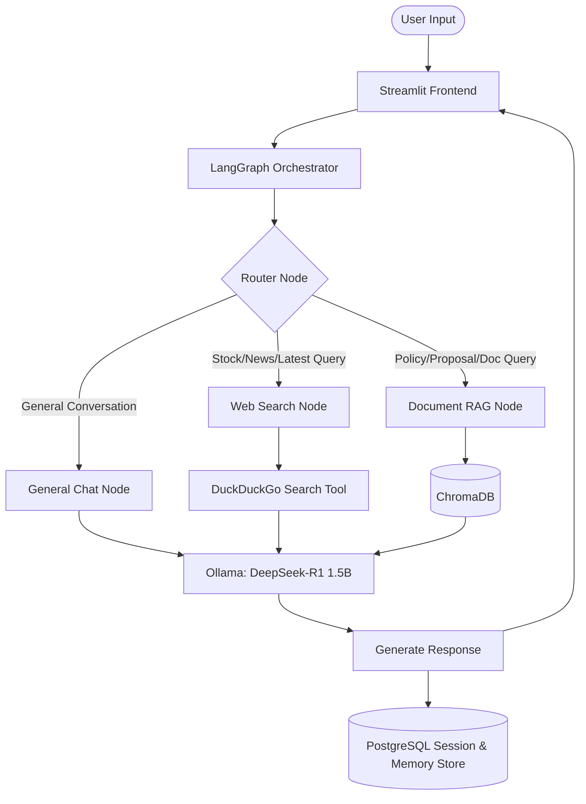

# AetherFlow 🤖

AetherFlow is a local, secure, and intelligent multi-mode AI assistant powered by **LangGraph**, **Ollama (DeepSeek-R1:1.5B)**, **ChromaDB**, and **PostgreSQL**. The application features dynamic semantic query routing, a private Document Retrieval-Augmented Generation (RAG) system, and web search capabilities—all delivered through an interactive **Streamlit** user interface.

---

## 🏗️ Architecture & How It Works

AetherFlow routes user queries dynamically to specialized processing nodes based on the conversation's context or manual UI overrides.



### 🧠 Core Component Walkthrough

1. **Streamlit Frontend ([main.py](file:///Users/aggiemariaeldo/Downloads/project-AI/src/main.py))**:
   - Provides a sidebar for session tracking, starting new chats, loading historical sessions, and deleting conversations.
   - Allows the user to select operational modes: *Auto-Route (AI Decision)*, *Mode 1 (General Chat)*, *Mode 2 (Web Search)*, or *Mode 3 (Document RAG)*.
   - Provides a PDF uploader component when in *Mode 3: Document RAG* to ingest session-scoped files.

2. **LangGraph Orchestration ([graph.py](file:///Users/aggiemariaeldo/Downloads/project-AI/src/agent/graph.py))**:
   - **Router Node**: Inspects incoming messages. If a specific mode is selected in the UI, it routes there directly. Otherwise, it uses heuristics (looking for keywords like "news", "latest", "policy", "proposal") and falls back to LLM intent analysis to choose the correct node.
   - **General Chat Node**: Reads conversation history from PostgreSQL to maintain context and queries the local Ollama LLM model.
   - **Web Search Node**: Uses the `DuckDuckGoSearchResults` tool to run web queries, feeding the context back to the LLM to write a summarized answer.
   - **Document RAG Node**: Queries ChromaDB vector store for matching document chunks (filtered by the active `session_id` or `"system_global"`) to perform context-augmented Q&A.

3. **Data Sync Engine ([sync_data.py](file:///Users/aggiemariaeldo/Downloads/project-AI/src/sync_data.py))**:
   - Scans the global `data/` directory for raw PDFs, chunking and embedding new files into ChromaDB under the `"system_global"` namespace, and logging their registry details in PostgreSQL to avoid duplicate parsing.

---

## 🛠️ Prerequisites

Before installing the project, make sure you have installed:

1. **Python (v3.10 or higher)**
2. **Ollama**: To host your local language model.
   - Download and install Ollama from [ollama.com](https://ollama.com/).
3. **PostgreSQL**: Relational database to persist chat sessions and historical messages.
   - Download and install PostgreSQL from [postgresql.org](https://www.postgresql.org/).

---

## 🚀 Installation & Setup

Follow these steps to set up and run AetherFlow on your machine:

### Step 1: Clone or Open the Project
Navigate to your project folder:
```bash
cd /Users/aggiemariaeldo/Downloads/project-AI
```

### Step 2: Set Up Virtual Environment & Dependencies
Create a Python virtual environment and install the required libraries:
```bash
# Create virtual environment
python3 -m venv venv

# Activate virtual environment (macOS/Linux)
source venv/bin/activate

# Install dependencies
pip install -r requirements.txt
```

### Step 3: Set Up the Local LLM
Start your Ollama app and pull the required model (DeepSeek-R1 1.5B):
```bash
ollama pull deepseek-r1:1.5b
```

### Step 4: Configure PostgreSQL Database
1. Open your PostgreSQL console (or pgAdmin) and create a database named `neostats_hackathon`:
   ```sql
   CREATE DATABASE neostats_hackathon;
   ```
2. Connect to the `neostats_hackathon` database and execute the following SQL schema to create the required tables:
   ```sql
   -- 1. Chat Sessions Table
   CREATE TABLE IF NOT EXISTS chat_sessions (
       session_id TEXT PRIMARY KEY,
       title TEXT NOT NULL DEFAULT 'New Conversation',
       created_at TIMESTAMP WITH TIME ZONE DEFAULT CURRENT_TIMESTAMP
   );

   -- 2. Short-Term Memory / Message History Table
   CREATE TABLE IF NOT EXISTS short_term_memory (
       id SERIAL PRIMARY KEY,
       session_id TEXT NOT NULL,
       role TEXT NOT NULL,
       content TEXT NOT NULL,
       timestamp TIMESTAMP DEFAULT CURRENT_TIMESTAMP
   );

   -- 3. Document Ingestion Registry Table
   CREATE TABLE IF NOT EXISTS document_registry (
       id SERIAL PRIMARY KEY,
       session_id TEXT NOT NULL,
       filename TEXT NOT NULL,
       upload_timestamp TIMESTAMP DEFAULT CURRENT_TIMESTAMP
   );
   ```

> [!NOTE]
> Ensure your database credentials match the `DB_CONFIG` definition inside [graph.py](file:///Users/aggiemariaeldo/Downloads/project-AI/src/agent/graph.py). If your local PostgreSQL password or port is different from the default (`root` / `5432`), edit the configuration block at the top of the file:
> ```python
> DB_CONFIG = {
>     "dbname": "neostats_hackathon",
>     "user": "postgres",
>     "password": "YOUR_PASSWORD_HERE",
>     "host": "localhost",
>     "port": "5432"
> }
> ```

---

## 📂 Data Preparation & Synchronization

To load enterprise documentation into the global knowledge base so the agent can reference them across chats:

1. Drop your PDF files into the local [data/](file:///Users/aggiemariaeldo/Downloads/project-AI/data) directory.
2. Run the synchronization script:
   ```bash
   python src/sync_data.py
   ```
This will parse all PDFs in the folder, create embeddings using the `all-MiniLM-L6-v2` transformer model, insert them into **ChromaDB**, and record the ingestion state in your **PostgreSQL** registry.

---

## 🏃 Running the Application

To launch the interactive Streamlit user interface:

```bash
streamlit run src/main.py
```

Open the local URL printed in your terminal (usually `http://localhost:8501`) to start chatting!

### 💡 Tips for Using the App
- **New Conversation**: Click **➕ New Chat** in the sidebar to generate a new session ID and clear the interface.
- **Session History**: All past conversations are saved to Postgres and can be reloaded by clicking them under **Past Conversations** in the sidebar.
- **Delete Session**: Clean up database clutter by clicking the trash bin icon (**🗑️**) next to any conversation.
- **RAG Uploads**: Switch to **Mode 3: Document RAG** to upload a document directly from the browser. It will be vectorized and attached specifically to your active session.

---

## 📁 Project Directory Structure

```text
project-AI/
├── chroma_db/             # Local database storage for vectorized document chunks
├── data/                  # Source folder for PDF documents (global knowledge base)
├── src/
│   ├── agent/
│   │   ├── graph.py       # LangGraph workspace workflow configuration & DB interfaces
│   │   ├── nodes.py       # Default intent-routing and chat processor nodes
│   │   └── state.py       # Typed state definition for LangGraph agents
│   ├── db/
│   │   └── schema.sql     # Database setup queries reference
│   ├── interface/
│   │   └── chat_ui.py     # Main Streamlit chat UI components
│   ├── homepage.py        # Streamlit home landing page styling & features
│   ├── main.py            # Streamlit application entrypoint
│   └── sync_data.py       # Document parser and database/vector sync runner
├── requirements.txt       # Python dependency declarations
└── README.md              # Project documentation (this file)
```
